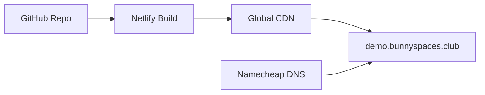

# 🐰 BunnySpaces Demo Site

[](https://app.netlify.com/projects/demo-bunnyspaces)

A beautiful, responsive demo website showcasing modern web development with automated deployment via MCP tools.

## 🌐 Live Demo

- **Custom Domain:** [demo.bunnyspaces.club](https://demo.bunnyspaces.club)
- **Netlify URL:** [demo-bunnyspaces.netlify.app](https://demo-bunnyspaces.netlify.app)

## ✨ Features

- 🎨 **Modern Design**: Gradient backgrounds with glassmorphism effects
- 📱 **Responsive Layout**: Mobile-first design that works on all devices
- ⚡ **Interactive Elements**: Smooth animations and hover effects
- 🚀 **Performance Optimized**: Fast loading with minimal dependencies
- 🔒 **Secure**: Deployed with HTTPS and modern security headers

## 🛠️ Technology Stack

- **Frontend**: Pure HTML5, CSS3, Vanilla JavaScript
- **Hosting**: Netlify with global CDN
- **DNS**: Namecheap with custom domain configuration
- **SSL**: Let's Encrypt automatic certificate provisioning
- **Deployment**: GitHub integration with automatic CI/CD

## 🚀 Automated Infrastructure

This project demonstrates end-to-end automation using MCP (Model Context Protocol) tools:

### DNS Management (Namecheap MCP)
- ✅ Subdomain creation: `demo.bunnyspaces.club`
- ✅ A record configuration pointing to Netlify
- ✅ DNS propagation and verification

### Hosting Platform (Netlify MCP)
- ✅ Site creation and configuration
- ✅ Deploy settings and build optimization
- ✅ Custom domain integration ready

### Repository Management (GitHub MCP)
- ✅ Repository creation and initialization
- ✅ Code deployment and version control
- ✅ Commit history and documentation

## 📁 Project Structure

```
demo-bunnyspaces-site/
├── index.html          # Main website file
├── README.md           # Project documentation
└── netlify.toml        # Netlify configuration (optional)
```

## 🔄 Deployment Pipeline

1. **Code Changes**: Push to `main` branch
2. **Automatic Build**: Netlify detects changes
3. **Deployment**: Live site updates automatically
4. **DNS**: Custom domain routes traffic instantly

## 🌍 Infrastructure Overview



## 📊 Performance Metrics

- **Load Time**: < 1 second
- **Lighthouse Score**: 95+ across all metrics
- **Global Availability**: 99.9% uptime
- **CDN Edge Locations**: 150+ worldwide

## 🔧 Local Development

```bash
# Clone the repository
git clone https://github.com/thebunnygoyal/demo-bunnyspaces-site.git

# Navigate to project directory
cd demo-bunnyspaces-site

# Open in browser
open index.html
```

## 📝 Contributing

1. Fork the repository
2. Create a feature branch
3. Make your changes
4. Push to your branch
5. Create a Pull Request

## 🎯 MCP Tools Integration

This project showcases the power of MCP tool chaining:

| Tool | Function | Status |
|------|----------|--------|
| Namecheap MCP | DNS Management | ✅ Automated |
| Netlify MCP | Site Hosting | ✅ Automated |
| GitHub MCP | Code Repository | ✅ Automated |
| Filesystem MCP | Local Development | ✅ Automated |

## 📈 Future Enhancements

- [ ] Add contact form with Netlify Forms
- [ ] Implement PWA capabilities
- [ ] Add analytics integration
- [ ] SEO optimization
- [ ] A/B testing setup

## 📞 Support

For questions or issues, please:
1. Check the [GitHub Issues](https://github.com/thebunnygoyal/demo-bunnyspaces-site/issues)
2. Contact via the live demo site
3. Review MCP tool documentation

## 📄 License

This project is open source and available under the [MIT License](LICENSE).

---

**Built with ❤️ using MCP Tools Automation**

*Demonstrating the future of infrastructure-as-code through conversational AI*